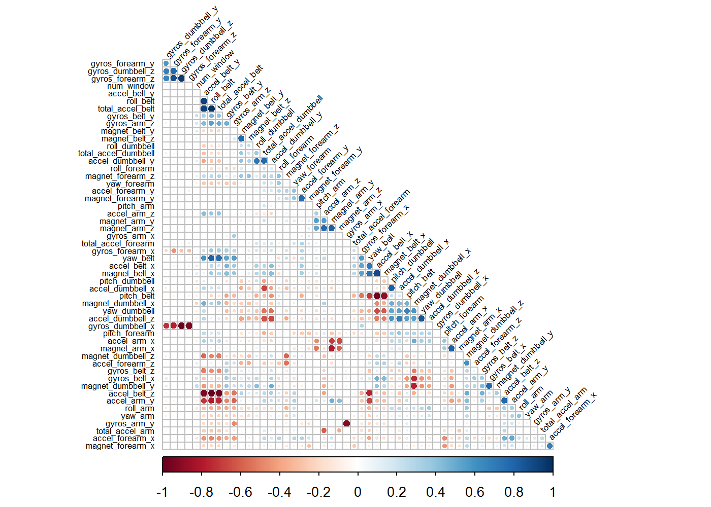

Practical Machine Learning Course Project
================
Christopher Arnold
May 16, 2017

Overview/Introduction
=====================

This project goes through the process of gathering the raw data from devices such as Nike FuelBand, Jawbone Up and Fitbit to the prediction of the performance of some participants based on a machine learning model. These devices collect a large amount of movement data relatively inexpensively and are able to give users information about their health in an effort to find patterns in behavior. This set of data takes information on barbell lifts and categorizes the lift by how well they performed. It would be useful to be able to predict the performance of the lift based on the data generated from one of these personal activity monitoring devices. It is our goal to pair the proper model to this set of data to give us the least out of box error in an effort to give the most accurate predictions.

``` r
trainURL    <- "https://d396qusza40orc.cloudfront.net/predmachlearn/pml-training.csv"
testURL     <- "https://d396qusza40orc.cloudfront.net/predmachlearn/pml-testing.csv"

trainData   <- read.csv(url(trainURL))
testData    <- read.csv(url(testURL))
```

Cleaning Data
-------------

``` r
inTrain     <- createDataPartition(trainData$classe, p = .7, list = FALSE)
TrainSet    <- trainData[inTrain,]
TestSet     <- trainData[-inTrain,]


dim(TrainSet)
```

    ## [1] 13737   160

We see that our Training set consists of 160 different variables, some of those are bound to be full of NA values or to have little variance and are thus of little importance to our prediction model. Let's first eliminate the variables that have zero variation.

``` r
ZeroVarianceCols <- nearZeroVar(TrainSet)
TrainSet <- TrainSet[, -ZeroVarianceCols]
TestSet <- TestSet[, -ZeroVarianceCols]
testData <- testData[, -ZeroVarianceCols]
dim(TrainSet)
```

    ## [1] 13737   106

``` r
numRemoved<-length(ZeroVarianceCols)
```

This process removed 54 columns from our data set. Let's continue to remove columns by looking at which variables are full of NA values.

``` r
nachecker <- function(x)
{
    nacheck <- is.na(x)
    return(length(nacheck[nacheck == TRUE])/length(nacheck))
}

mostNA      <- sapply(TrainSet, FUN =  nachecker) > .95

numRemoved  <- length(mostNA[mostNA == TRUE])

TrainSet    <- TrainSet[, mostNA == FALSE]
TestSet     <- TestSet[, mostNA == FALSE]
testData    <- testData[, mostNA == FALSE]

dim(TrainSet)
```

    ## [1] 13737    59

This process removed another 47 columns from our data set. This leaves us with 59. We will finally remove the first few columns of the data set that are not pertinent to predicting the outcome of the exercise, these are the X, user\_name, raw\_timestamp\_part\_1, raw\_timestamp\_part\_2, cvtd\_timestamp

``` r
TrainSet <- TrainSet[, -(1:5)]
TestSet <- TestSet[,-(1:5)]
testData <- testData[, -(1:5)]

dim(TrainSet)
```

    ## [1] 13737    54

``` r
finalCols <- ncol(TrainSet)
```

After this process of cleaning we are left with 54 columns in our data. That means our prediction variable and 53 predictors.

Although, 54 out of the original 160 is a reasonable estimate of usable predictors, it may be useful to see if any of the remaining predictors are highly correlated. This could lead us to removing those columns or performing a pricipal components analysis to transform our data to a select few predictors.

``` r
correlation <- cor(TrainSet[,-54])

kable(head(round(correlation,2)))
```

|                    |  num\_window|  roll\_belt|  pitch\_belt|  yaw\_belt|  total\_accel\_belt|  gyros\_belt\_x|  gyros\_belt\_y|  gyros\_belt\_z|  accel\_belt\_x|  accel\_belt\_y|  accel\_belt\_z|  magnet\_belt\_x|  magnet\_belt\_y|  magnet\_belt\_z|  roll\_arm|  pitch\_arm|  yaw\_arm|  total\_accel\_arm|  gyros\_arm\_x|  gyros\_arm\_y|  gyros\_arm\_z|  accel\_arm\_x|  accel\_arm\_y|  accel\_arm\_z|  magnet\_arm\_x|  magnet\_arm\_y|  magnet\_arm\_z|  roll\_dumbbell|  pitch\_dumbbell|  yaw\_dumbbell|  total\_accel\_dumbbell|  gyros\_dumbbell\_x|  gyros\_dumbbell\_y|  gyros\_dumbbell\_z|  accel\_dumbbell\_x|  accel\_dumbbell\_y|  accel\_dumbbell\_z|  magnet\_dumbbell\_x|  magnet\_dumbbell\_y|  magnet\_dumbbell\_z|  roll\_forearm|  pitch\_forearm|  yaw\_forearm|  total\_accel\_forearm|  gyros\_forearm\_x|  gyros\_forearm\_y|  gyros\_forearm\_z|  accel\_forearm\_x|  accel\_forearm\_y|  accel\_forearm\_z|  magnet\_forearm\_x|  magnet\_forearm\_y|  magnet\_forearm\_z|
|--------------------|------------:|-----------:|------------:|----------:|-------------------:|---------------:|---------------:|---------------:|---------------:|---------------:|---------------:|----------------:|----------------:|----------------:|----------:|-----------:|---------:|------------------:|--------------:|--------------:|--------------:|--------------:|--------------:|--------------:|---------------:|---------------:|---------------:|---------------:|----------------:|--------------:|-----------------------:|-------------------:|-------------------:|-------------------:|-------------------:|-------------------:|-------------------:|--------------------:|--------------------:|--------------------:|--------------:|---------------:|-------------:|----------------------:|------------------:|------------------:|------------------:|------------------:|------------------:|------------------:|-------------------:|-------------------:|-------------------:|
| num\_window        |         1.00|        0.08|        -0.11|       0.09|                0.07|            0.21|            0.23|            0.07|            0.14|            0.05|           -0.06|             0.12|             0.15|             0.11|      -0.12|       -0.03|     -0.04|              -0.07|           0.04|          -0.06|           0.18|          -0.11|          -0.10|          -0.02|            0.03|           -0.01|            0.02|            0.03|            -0.16|          -0.11|                    0.08|               -0.03|                0.07|                0.02|               -0.11|                0.14|               -0.10|                -0.24|                 0.24|                -0.01|          -0.01|           -0.05|         -0.09|                  -0.02|               0.05|               0.02|               0.02|              -0.15|              -0.02|               0.12|               -0.07|                0.06|                0.11|
| roll\_belt         |         0.08|        1.00|        -0.22|       0.82|                0.98|           -0.12|            0.46|           -0.46|            0.26|            0.92|           -0.99|             0.35|            -0.21|            -0.07|      -0.37|        0.06|     -0.23|              -0.27|           0.03|          -0.22|           0.54|           0.23|          -0.79|           0.39|            0.09|            0.01|            0.02|           -0.13|             0.06|           0.03|                   -0.19|                0.01|                0.05|                0.00|                0.21|               -0.27|                0.11|                 0.31|                -0.30|                -0.50|          -0.16|            0.17|         -0.26|                   0.07|               0.37|               0.04|               0.02|              -0.49|               0.04|               0.08|               -0.20|                0.03|                0.27|
| pitch\_belt        |        -0.11|       -0.22|         1.00|      -0.70|               -0.14|           -0.44|           -0.41|           -0.11|           -0.97|            0.08|            0.16|            -0.88|            -0.09|            -0.13|       0.17|       -0.16|      0.14|               0.09|          -0.06|           0.12|          -0.32|           0.20|           0.23|           0.05|           -0.04|            0.05|            0.00|           -0.35|             0.23|           0.66|                   -0.32|                0.01|               -0.03|               -0.01|                0.16|               -0.45|                0.54|                 0.47|                -0.37|                -0.26|           0.14|            0.26|          0.05|                  -0.33|              -0.53|              -0.06|              -0.08|               0.13|              -0.36|              -0.24|               -0.07|               -0.02|               -0.07|
| yaw\_belt          |         0.09|        0.82|        -0.70|       1.00|                0.76|            0.15|            0.53|           -0.27|            0.71|            0.60|           -0.78|             0.74|            -0.06|             0.09|      -0.33|        0.14|     -0.23|              -0.24|           0.04|          -0.22|           0.55|           0.06|          -0.68|           0.25|            0.08|           -0.01|            0.01|            0.10|            -0.10|          -0.35|                    0.05|                0.00|                0.04|                0.00|                0.05|                0.06|               -0.23|                -0.03|                -0.03|                -0.21|          -0.18|           -0.04|         -0.19|                   0.23|               0.56|               0.07|               0.06|              -0.40|               0.24|               0.18|               -0.09|                0.05|                0.23|
| total\_accel\_belt |         0.07|        0.98|        -0.14|       0.76|                1.00|           -0.17|            0.40|           -0.48|            0.18|            0.93|           -0.97|             0.29|            -0.21|            -0.06|      -0.36|        0.05|     -0.21|              -0.26|           0.02|          -0.21|           0.51|           0.25|          -0.76|           0.40|            0.08|            0.04|            0.02|           -0.14|             0.05|           0.06|                   -0.17|                0.02|                0.04|                0.00|                0.19|               -0.27|                0.12|                 0.36|                -0.35|                -0.51|          -0.12|            0.18|         -0.24|                   0.04|               0.34|               0.03|               0.01|              -0.45|               0.02|               0.05|               -0.19|                0.04|                0.29|
| gyros\_belt\_x     |         0.21|       -0.12|        -0.44|       0.15|               -0.17|            1.00|            0.33|            0.34|            0.48|           -0.28|            0.16|             0.43|             0.12|             0.24|      -0.25|       -0.03|     -0.14|               0.00|           0.07|          -0.05|           0.28|          -0.38|          -0.08|          -0.27|            0.02|           -0.14|           -0.02|            0.26|            -0.20|          -0.44|                    0.07|               -0.06|                0.12|                0.02|               -0.14|                0.30|               -0.36|                -0.75|                 0.79|                 0.23|          -0.21|           -0.16|         -0.17|                   0.06|               0.12|               0.03|               0.02|              -0.21|              -0.03|               0.35|                0.05|                0.03|               -0.11|

``` r
corrplot(correlation, type = "lower", sig.level = .5, insig = "blank", tl.cex = .5, tl.col = "black", diag = FALSE, tl.srt = 45, order = "hclust")
```



From this plot we see that there are only a handful of places where there is heavy correlation between variables. We will leave our dataset at 53 predictors.

This may also be a good time to take a look at the variable we are attempting to predict in the Training set to get an idea of the distribution.

``` r
barchart(TrainSet$classe)
```


``` r
table(TrainSet$classe)
```

    ## 
    ##    A    B    C    D    E 
    ## 3906 2658 2396 2252 2525

From this we see that classe A is the most populous of the classes in the train set and we will look for our prediction model to come up with something similar.

Prediction Modeling
-------------------

We are going to be predicting classifiers so the natural predicting models will be:

-   Decision Trees
-   Gradient Boosted Models (GBM)
-   Random Forest

If none of these provide high accuracy we may ensemble the Random Forest with the Gradient Boosted Machine to see if that can improve the result. I will use a control method with the GBM and Random forest and compare different methods in the model creation to see if that makes a difference in accuracy.

``` r
decisionTree.model <- train(classe ~ ., method = "rpart", data = TrainSet)
decisionTree.preds <- predict(decisionTree.model, newdata = TestSet)

decisionTree.confmat <- confusionMatrix(decisionTree.preds, TestSet$classe)
decisionTree.confmat
```

    ## Confusion Matrix and Statistics
    ## 
    ##           Reference
    ## Prediction    A    B    C    D    E
    ##          A 1494  470  467  416   95
    ##          B   21  380   29  184   90
    ##          C  128  289  530  324  219
    ##          D    0    0    0    0    0
    ##          E   31    0    0   40  678
    ## 
    ## Overall Statistics
    ##                                           
    ##                Accuracy : 0.5237          
    ##                  95% CI : (0.5109, 0.5365)
    ##     No Information Rate : 0.2845          
    ##     P-Value [Acc > NIR] : < 2.2e-16       
    ##                                           
    ##                   Kappa : 0.3791          
    ##  Mcnemar's Test P-Value : < 2.2e-16       
    ## 
    ## Statistics by Class:
    ## 
    ##                      Class: A Class: B Class: C Class: D Class: E
    ## Sensitivity            0.8925  0.33363  0.51657   0.0000   0.6266
    ## Specificity            0.6561  0.93173  0.80243   1.0000   0.9852
    ## Pos Pred Value         0.5078  0.53977  0.35570      NaN   0.9052
    ## Neg Pred Value         0.9388  0.85350  0.88714   0.8362   0.9213
    ## Prevalence             0.2845  0.19354  0.17434   0.1638   0.1839
    ## Detection Rate         0.2539  0.06457  0.09006   0.0000   0.1152
    ## Detection Prevalence   0.4999  0.11963  0.25319   0.0000   0.1273
    ## Balanced Accuracy      0.7743  0.63268  0.65950   0.5000   0.8059

``` r
decisionTree.acc <- decisionTree.confmat$overall[[1]]
decisionTree.oobe <- 1 - decisionTree.acc
```

``` r
gbmcontrol <- trainControl(method = "repeatedcv", number = 10, repeats =  1)
gbm.cv.model <- train(classe ~ ., method = "gbm", data = TrainSet, verbose = FALSE, trControl = gbmcontrol)
```

    ## Loading required package: gbm

    ## Loading required package: survival

    ## 
    ## Attaching package: 'survival'

    ## The following object is masked from 'package:caret':
    ## 
    ##     cluster

    ## Loading required package: splines

    ## Loading required package: parallel

    ## Loaded gbm 2.1.3

    ## Loading required package: plyr

``` r
gbm.cv.preds <- predict(gbm.cv.model, newdata = TestSet)

gbm.cv.confmat <- confusionMatrix(gbm.cv.preds, TestSet$classe)
gbm.cv.confmat
```

    ## Confusion Matrix and Statistics
    ## 
    ##           Reference
    ## Prediction    A    B    C    D    E
    ##          A 1670   14    0    3    0
    ##          B    3 1110   18    5    3
    ##          C    0   12 1005   19    2
    ##          D    1    3    3  937   11
    ##          E    0    0    0    0 1066
    ## 
    ## Overall Statistics
    ##                                           
    ##                Accuracy : 0.9835          
    ##                  95% CI : (0.9799, 0.9866)
    ##     No Information Rate : 0.2845          
    ##     P-Value [Acc > NIR] : < 2.2e-16       
    ##                                           
    ##                   Kappa : 0.9791          
    ##  Mcnemar's Test P-Value : NA              
    ## 
    ## Statistics by Class:
    ## 
    ##                      Class: A Class: B Class: C Class: D Class: E
    ## Sensitivity            0.9976   0.9745   0.9795   0.9720   0.9852
    ## Specificity            0.9960   0.9939   0.9932   0.9963   1.0000
    ## Pos Pred Value         0.9899   0.9745   0.9682   0.9812   1.0000
    ## Neg Pred Value         0.9990   0.9939   0.9957   0.9945   0.9967
    ## Prevalence             0.2845   0.1935   0.1743   0.1638   0.1839
    ## Detection Rate         0.2838   0.1886   0.1708   0.1592   0.1811
    ## Detection Prevalence   0.2867   0.1935   0.1764   0.1623   0.1811
    ## Balanced Accuracy      0.9968   0.9842   0.9864   0.9842   0.9926

``` r
gbm.cv.acc <- gbm.cv.confmat$overall[[1]]
gbm.cv.oobe <- 1-gbm.cv.acc
```

``` r
gbm.pca.model <- train(classe~., method = "gbm", data = TrainSet, verbose = FALSE, trControl = gbmcontrol, preProcess = "pca")
gbm.pca.preds <- predict(gbm.pca.model, newdata = TestSet)
gbm.pca.confmat <- confusionMatrix(gbm.pca.preds, TestSet$classe)
gbm.pca.confmat
```

    ## Confusion Matrix and Statistics
    ## 
    ##           Reference
    ## Prediction    A    B    C    D    E
    ##          A 1501  113   70   32   29
    ##          B   51  833   89   47   75
    ##          C   52  117  820  114   56
    ##          D   58   43   28  744   41
    ##          E   12   33   19   27  881
    ## 
    ## Overall Statistics
    ##                                          
    ##                Accuracy : 0.8121         
    ##                  95% CI : (0.8018, 0.822)
    ##     No Information Rate : 0.2845         
    ##     P-Value [Acc > NIR] : < 2.2e-16      
    ##                                          
    ##                   Kappa : 0.762          
    ##  Mcnemar's Test P-Value : < 2.2e-16      
    ## 
    ## Statistics by Class:
    ## 
    ##                      Class: A Class: B Class: C Class: D Class: E
    ## Sensitivity            0.8967   0.7313   0.7992   0.7718   0.8142
    ## Specificity            0.9421   0.9448   0.9302   0.9655   0.9811
    ## Pos Pred Value         0.8602   0.7607   0.7075   0.8140   0.9064
    ## Neg Pred Value         0.9582   0.9361   0.9564   0.9557   0.9591
    ## Prevalence             0.2845   0.1935   0.1743   0.1638   0.1839
    ## Detection Rate         0.2551   0.1415   0.1393   0.1264   0.1497
    ## Detection Prevalence   0.2965   0.1861   0.1969   0.1553   0.1652
    ## Balanced Accuracy      0.9194   0.8381   0.8647   0.8686   0.8976

``` r
gbm.pca.acc <- gbm.pca.confmat$overall[[1]]
gbm.pca.oobe <- 1- gbm.pca.acc
```

``` r
rf.cv.model <- train(classe~., method = "rf", data = TrainSet, trControl = gbmcontrol)
rf.cv.preds <- predict(rf.cv.model, newdata = TestSet)
rf.cv.confmat <- confusionMatrix(rf.cv.preds, TestSet$classe)
rf.cv.confmat
```

    ## Confusion Matrix and Statistics
    ## 
    ##           Reference
    ## Prediction    A    B    C    D    E
    ##          A 1674    5    0    0    0
    ##          B    0 1132    2    0    0
    ##          C    0    2 1024    8    0
    ##          D    0    0    0  956    3
    ##          E    0    0    0    0 1079
    ## 
    ## Overall Statistics
    ##                                           
    ##                Accuracy : 0.9966          
    ##                  95% CI : (0.9948, 0.9979)
    ##     No Information Rate : 0.2845          
    ##     P-Value [Acc > NIR] : < 2.2e-16       
    ##                                           
    ##                   Kappa : 0.9957          
    ##  Mcnemar's Test P-Value : NA              
    ## 
    ## Statistics by Class:
    ## 
    ##                      Class: A Class: B Class: C Class: D Class: E
    ## Sensitivity            1.0000   0.9939   0.9981   0.9917   0.9972
    ## Specificity            0.9988   0.9996   0.9979   0.9994   1.0000
    ## Pos Pred Value         0.9970   0.9982   0.9903   0.9969   1.0000
    ## Neg Pred Value         1.0000   0.9985   0.9996   0.9984   0.9994
    ## Prevalence             0.2845   0.1935   0.1743   0.1638   0.1839
    ## Detection Rate         0.2845   0.1924   0.1740   0.1624   0.1833
    ## Detection Prevalence   0.2853   0.1927   0.1757   0.1630   0.1833
    ## Balanced Accuracy      0.9994   0.9967   0.9980   0.9955   0.9986

``` r
rf.cv.acc <- rf.cv.confmat$overall[[1]]
rf.cv.oobe <- 1- rf.cv.acc
```

``` r
rf.pca.model <- train(classe ~ ., method = "rf", data = TrainSet, trControl = gbmcontrol, preProcess = "pca")
rf.pca.preds <- predict(rf.pca.model, newdata = TestSet)
rf.pca.confmat <- confusionMatrix(rf.pca.preds, TestSet$classe)
rf.pca.confmat
```

    ## Confusion Matrix and Statistics
    ## 
    ##           Reference
    ## Prediction    A    B    C    D    E
    ##          A 1664   19    2    0    1
    ##          B    5 1102   18    3    4
    ##          C    3   16  990   49    4
    ##          D    2    0   14  909    7
    ##          E    0    2    2    3 1066
    ## 
    ## Overall Statistics
    ##                                           
    ##                Accuracy : 0.9738          
    ##                  95% CI : (0.9694, 0.9778)
    ##     No Information Rate : 0.2845          
    ##     P-Value [Acc > NIR] : < 2.2e-16       
    ##                                           
    ##                   Kappa : 0.9669          
    ##  Mcnemar's Test P-Value : 5.979e-05       
    ## 
    ## Statistics by Class:
    ## 
    ##                      Class: A Class: B Class: C Class: D Class: E
    ## Sensitivity            0.9940   0.9675   0.9649   0.9429   0.9852
    ## Specificity            0.9948   0.9937   0.9852   0.9953   0.9985
    ## Pos Pred Value         0.9870   0.9735   0.9322   0.9753   0.9935
    ## Neg Pred Value         0.9976   0.9922   0.9925   0.9889   0.9967
    ## Prevalence             0.2845   0.1935   0.1743   0.1638   0.1839
    ## Detection Rate         0.2828   0.1873   0.1682   0.1545   0.1811
    ## Detection Prevalence   0.2865   0.1924   0.1805   0.1584   0.1823
    ## Balanced Accuracy      0.9944   0.9806   0.9750   0.9691   0.9919

``` r
rf.pca.acc <- rf.pca.confmat$overall[[1]]
rf.pca.oobe <- 1 - rf.pca.acc
```

``` r
oobe <- c(decisionTree.oobe, gbm.cv.oobe, gbm.pca.oobe, rf.cv.oobe, rf.pca.oobe)
acc <- c(decisionTree.acc, gbm.cv.acc, gbm.pca.acc, rf.cv.acc, rf.pca.acc)
modelname <- c("Decision Tree", "GBM w/ Cross Valid.", "GBM w/ PCA", "Random Forest w/ Cross Valid.", "Random Forest w/ PCA")

errorframe <- data.frame(modelnames = modelname, Accuracy = acc, OutOfBoxError = oobe)

errorframe
```

    ##                      modelnames  Accuracy OutOfBoxError
    ## 1                 Decision Tree 0.5237043   0.476295667
    ## 2           GBM w/ Cross Valid. 0.9835174   0.016482583
    ## 3                    GBM w/ PCA 0.8120646   0.187935429
    ## 4 Random Forest w/ Cross Valid. 0.9966015   0.003398471
    ## 5          Random Forest w/ PCA 0.9738318   0.026168224

We see that the Random Forest model with cross validation in the training control produces the model with the lowest out of box error rate. We can now use this to predict on the testdata from the separate url that we have not touched since cleaning the data.

``` r
predictions <- predict(rf.cv.model, newdata = testData)
predictions
```

    ##  [1] B A B A A E D B A A B C B A E E A B B B
    ## Levels: A B C D E
